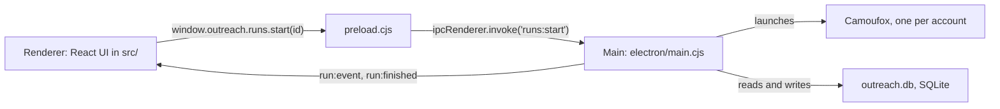

# Architecture

For developers and coding agents who will change the app. Read [concepts.md](concepts.md) first: this page assumes you know what a step, an item kind, the action ledger and a cap are.

## The three processes

HireDue Outreach is an Electron app, so it runs as separate processes that talk over IPC (inter-process calls, Electron's message passing).



- **Main** (`electron/main.cjs`) owns everything with side effects: the database, the browser, the AI calls, the scheduler. It registers one IPC handler per action, such as `workflows:save` or `crm:contacts:list`, and wraps each so an exception comes back as `{ error }`.
- **Preload** (`electron/preload.cjs`) is the only bridge. It exposes `window.outreach` with methods like `window.outreach.workflows.save(wf)` and turns an `{ error }` reply back into a thrown error. The renderer has no Node access.
- **Renderer** (`src/`) is React 19 with shadcn/ui and Tailwind v4. It draws screens and calls `window.outreach`. It holds no business rules.

The end-to-end tests drive the app through the same `window.outreach`, so anything the UI can do, a test can do without clicking.

## Where code goes

Every file in `electron/` is one of three things, and the folder tells you which.

| Kind | Folder | Rule | Example |
|---|---|---|---|
| A rule | `electron/domain/` | Pure functions. No page, no network, no database, no clock unless passed in. Tested with plain `node --test`. | `outreach.cjs` decides a person's next move from their state and conversation; it never opens one |
| An adapter | `electron/adapters/` | The only code that touches the outside world: LinkedIn pages, the AI endpoint, SQLite, HTTP. | `linkedin.adapter.cjs` clicks Connect and reads the Pending badge |
| A tunable | `electron/constants.cjs` | Every URL, CSS selector, pause, timeout and cap. | `LIMITS.CONNECT_PER_DAY = 20` |

When LinkedIn changes its markup, the fix is usually one selector in `constants.cjs`. When a rule changes ("drop people after two follow-ups, not three"), it lands in `domain/` with a test. If you find yourself writing a CSS selector in `domain/` or an `if` about business policy in an adapter, it is in the wrong place.

The files that tie these together:

| File | Job |
|---|---|
| `nodes.cjs` | The step catalog: every step's label, group, inputs, outputs, settings and `run` function |
| `nodes.crm.cjs` | The CRM, follow-up and outreach steps, merged into the catalog by `nodes.cjs` |
| `steps.cjs` | The loops every step is built from: `eachItem` and `actOnEach` |
| `runner.cjs` | One run: open the browser, check the login, run the graph, save the results |
| `scheduler.cjs` | Fires Schedule and Poll API triggers of Active workflows, and due follow-ups |
| `templates.cjs` | The starter and built-in workflows. Each has a `key`; `main.cjs` adds each key once per install, so a new release can add a workflow and a deleted one stays deleted |

## The engine

`domain/graph.cjs` checks a workflow before it runs: exactly the problems the editor shows in red. Required settings filled in, at least one trigger, every arrow from a real handle, no loops, and every step receiving a kind it accepts. A `same` output passes on whatever kind arrived, so kinds are worked out in execution order.

`domain/engine.cjs` runs it. It sorts the steps so each runs after everything feeding it (a topological sort), then for each step gathers the items on its incoming arrows and calls `def.run(items, params, ctx)`. The step returns an object keyed by handle, such as `{ pass: [...], fail: [...] }`, and the engine refuses a handle the step did not declare. A step with no items is skipped. The engine knows nothing about LinkedIn.

`ctx` is how a step reaches the outside world:

| Field | What it is |
|---|---|
| `ctx.linkedin` | the LinkedIn adapter for this account's page, or the fake in tests |
| `ctx.llm` | `chatJson({ system, user })`, returns `{ ok, value }` or `{ ok: false, error }` |
| `ctx.store` | the database adapter |
| `ctx.accountId`, `ctx.workflowId`, `ctx.runId`, `ctx.nodeId` | where we are |
| `ctx.emit(event)` | write to the run log; `{ type: "log", message }` or `{ type: "item.failed", message }` |
| `ctx.shouldStop()` | true once someone pressed Stop |

## The runner and the scheduler

`runner.cjs` `start(workflowId)` validates the workflow, refuses if the account already has a run or a login window open (error code `BUSY`), records a `runs` row with a snapshot of the graph, and returns the run id at once. The run itself continues in the background: open Camoufox on `accounts/<id>/browser`, `ensureLoggedIn()`, `engine.run(...)`, then in `finally` save outputs, file people and posts into the CRM with `store.crm.absorbRun`, close the browser and send `run:finished`. A CRM filing error is logged but never loses the run's own result.

`scheduler.cjs` ticks every 30 seconds (`TRIGGERS.TICK_MS`). Each tick it looks at every Active workflow's Schedule and Poll API steps, fires those that are due, and works out the next time with `domain/schedule.cjs`. A `BUSY` account retries in 5 minutes. Schedule intervals below 15 minutes are raised to 15, and polls below 5 minutes to 5.

## Store tables

All in one SQLite file, `outreach.db`, opened by `adapters/store.adapter.cjs`. New columns are added in `migrate()`, because SQLite has no `ADD COLUMN IF NOT EXISTS`.

| Table | Holds |
|---|---|
| `accounts` | LinkedIn accounts: name, profile link, last login |
| `workflows` | name, account, `active`, and the graph as JSON |
| `runs` | status, who fired it, the graph snapshot, a per-step summary |
| `run_events` | every log line and step event of a run |
| `run_outputs` | every item each step handed on, per handle |
| `actions` | the action ledger: account, target, action, status, run, time |
| `trigger_state` | per trigger: next fire time, last result, last error, the Poll API keys already seen |
| `contacts` | CRM people, one per account and profile link, with stage, tags, notes, the latest item data, the workflow that first found them, and the Outreach sequence state as JSON in `outreach` |
| `posts` | CRM posts, one per account and post |
| `crm_events` | the timeline shown on a CRM record |
| `followups` | Follow-up sequence rows: steps, next due time, status. The Outreach sequence step does not use this table |
| `settings` | endpoint, model, encrypted API key, `outreach.calendarLink`, headless, `seeded.templates` (built-in workflows already added), `notes.unavailableUntil.<account id>` (when an account may try invite notes again) |

Two rules are enforced in SQL rather than only in code: `actions.alreadyDone` treats `sent`, `pending`, `connected`, `already_messaged` and `already` as done, and `countSince` counts only `sent`.

## The fake LinkedIn

`adapters/fake.adapter.cjs` is a scripted LinkedIn and AI model with the same functions as the real adapters. Setting `OUTREACH_FAKE=<scenario>` makes `main.cjs` use it. It has six people (Ana Seeker, Ben Builder and so on), five posts, a pre-existing conversation with Eli Founder, and a page you already follow. Every outward action is appended to the file in `OUTREACH_FAKE_LOG`, so a test can compare what the fake "did on LinkedIn" with what the ledger recorded.

Scenarios: `default`, `logged-out`, `invite-limit` (LinkedIn's limit after 2 invites), `flaky` (the same items fail every time), `unverified` (no action is ever confirmed), `slow` (250 ms pauses, so a test can press Stop mid-step), `no-note` (Add a note leads to the Premium upsell, as on a free account out of notes).

When you add an adapter function, add the same function to the fake, or the end-to-end tests cannot reach your step.

## Adding a step

A step is one entry in the catalog. The editor reads the catalog over IPC (`catalog:list`), so the palette and settings form pick up a new step with no UI change.

### Worked example: keep only the first N items

Say people searches return 40 profiles and you want to send only the first 10 to the expensive AI step. Add this to the `steps` object in `electron/nodes.cjs`:

```js
takeFirst: {
  label: "Take first", group: "Logic", icon: "ListFilter",
  description: "Passes on only the first N items it receives. The rest are dropped.",
  input: "any", outputs: [{ handle: "out", kind: "same" }],
  params: [{ key: "count", label: "How many", kind: "number", default: 10 }],
  validate: (p) => (Number(p.count) >= 1 ? [] : ["How many must be at least 1"]),
  run: async (items, p, ctx) => {
    const kept = items.slice(0, Number(p.count));
    ctx.emit({ type: "log", message: `Kept ${kept.length} of ${items.length}` });
    return { out: kept };
  },
},
```

What each field does:

- `group` places it in the palette. The order is fixed in `GROUPS`: Triggers, Search, Feed, Posts, Profile, Messaging, CRM, AI, Logic.
- `icon` is a lucide-react icon name.
- `input` is `null` for a trigger, a kind (`"person"`), a list of kinds (`["person", "post"]`), or `"any"`.
- `outputs` lists handles. `kind: "same"` passes on the input's kind. `kind: "param:itemKind"` takes the kind from a setting, as LinkedIn URLs does.
- `params` drive the settings form. `kind` is one of `text`, `textarea`, `number`, `select` (with `options`), `outputFields`, `conditions` or `sequence`. `required: true` makes the editor flag it when blank.
- `validate` returns a list of problems for settings that can be filled in and still be wrong. The editor shows them and the run refuses to start.
- `run` gets the items, the settings and `ctx`, and returns an object keyed by handle.

Then add a test in `test/nodes.test.cjs`, in the same style as the ones there: build a small `ctx`, call `catalog.takeFirst.run(...)`, assert on the output. Run `npm test`.

### A step that acts on LinkedIn

Anything another person can see goes through `actOnEach` in `steps.cjs`. It does the skip, cap, record and verify sequence for you, so the step only says what to do to one item:

```js
run: async (people, p, ctx) => ({
  out: await actOnEach(people, ctx, {
    action: "endorse", noun: "Endorsement", perDay: p.perDay, targetOf: (x) => x.profileUrl,
    act: (person) => ctx.linkedin.endorse(person, p.skill),
  }),
}),
```

For that you also need:

1. `endorse(person, skill)` in `adapters/linkedin.adapter.cjs`, returning `{ status: "sent" }` only once LinkedIn shows proof, and `unverified` or `failed` otherwise. Never return `sent` because a click succeeded.
2. The same function in `adapters/fake.adapter.cjs`, logging the action.
3. Any selectors in `SELECTORS` and the default cap in `LIMITS`, both in `constants.cjs`.
4. A unit test with a fake `ctx.linkedin`, and an end-to-end test in `test/e2e/actions.test.cjs`.

The action name (`"endorse"`) becomes the ledger's `action` column. Never-twice and the cap both key on it, per account.

### Rules a step must keep

- Use `eachItem` or `actOnEach`, so one bad person costs only that person, three failures at the start stop the step, and Stop works.
- Let `NotLoggedIn` propagate. It ends the run, which is right.
- Text another person reads goes through `renderOutgoing`, which throws on a missing placeholder. Use `render` only for notes to yourself.
- An AI answer you cannot read is an error, never a default.
- Wait between people with `await ctx.linkedin.pause()`.

## Testing

```bash
npm test            # unit tests: domain rules and steps, no browser, a few seconds
npx vite build      # needed once, and after any change in src/, before the UI tests
npm run test:e2e    # end-to-end: the real app against the fake LinkedIn, under a minute
```

Unit tests live in `test/*.test.cjs`, one per domain file plus `nodes.test.cjs` for the steps.

End-to-end tests in `test/e2e/` start the real Electron app with the fake adapter. They run the real main process, IPC, runner, scheduler, steps and SQLite, but never open a browser, never touch a LinkedIn account and never call the AI endpoint. `harness.cjs` gives each test file its own data folder (`OUTREACH_USER_DATA`) and makes the scheduler tick every 200 ms (`OUTREACH_TICK_MS`). Tests of things due days later quit, then relaunch on the same data with the clock moved forward (`OUTREACH_CLOCK_OFFSET_MS`). These variables exist only for tests.

Most end-to-end tests load a blank page and call `window.outreach`. `ui.test.cjs` is the exception: it loads the built UI from `dist/` and clicks through real screens, finding elements by `data-testid`. Rename a `data-testid` in `src/` and that test breaks; build first or it tests a stale UI.

A test marked TODO describes a known bug. It runs and reports but does not fail the suite.

## What is not verified against live LinkedIn

Selectors marked "verified" in `constants.cjs` came from `hiredue-desktop-application`, where they run in production: login state, post search cards, the profile top card, connect without a note, and the message box. Everything else was written without a logged-in session to check against:

- reading comments on a post (`SELECTORS.COMMENT`, `readComments`);
- people search result cards, including the snippet text the Topmate search filters on (`readPeopleCards`, `parsePersonCard`);
- the connection note: the Add a note button, its text box, and Send;
- like, comment, repost and follow buttons;
- reading a conversation (`SELECTORS.THREAD_*`, `readThreadEvents`), including telling their messages from yours, which Check replies, follow-ups and Outreach sequence all depend on;
- the home feed cards.

Each of these checks LinkedIn's result before counting it, so a stale selector shows up as `failed` or `unverified`, or as "could not read the conversation", not as a false success. Before trusting one on a real account, run it once with the browser visible and a cap of 1 or 2, and watch.
