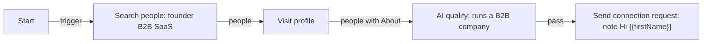

# Building workflows

How to build your own workflow, write messages that fill in per person, let the AI make decisions you can check, run it on a timer, and test it without burning your account's invites.

## Build one in the editor

1. In the sidebar, press **+** next to **Workflows**. A new "Untitled workflow" opens in the editor with a Start step on the canvas.
2. The left panel is the palette, grouped as Triggers, Search, Feed, Posts, Profile, Messaging, CRM, AI, Logic. Click a step, or drag it onto the canvas.
3. Connect steps by dragging from an output dot on the right of one step to the input dot on the left of the next. Steps with two outputs, such as AI qualify, have one dot per output; pick the one you want.
4. Click a step to open its settings in the right panel. The **Last output** tab shows what it produced in the latest run.
5. Name the workflow at the top, then press **Save**. The editor edits a copy; nothing is kept until you save.
6. Back on the workflow page, choose the LinkedIn account it runs on.

Problems show in a "Fix these before running" box and as red marks on the steps: a required setting left blank, a step with nothing connected to its input, an arrow carrying posts into a step that wants people. Run stays disabled until they are fixed, and switching Active on is refused.

A minimal useful workflow, invite founders with a short note:

The `fail` output of AI qualify has no arrow, so people who fail stop there. They are still filed in the CRM with their score.

## Templates and placeholders

Notes, messages, comments and the Update CRM note are templates. `{{name}}` is replaced with the item's field of that name. A dotted path reads inside a field.

| Placeholder | Comes from | Example value |
|---|---|---|
| `{{firstName}}` | the person's name, first word, skipping Dr, Mr, Prof and similar | `Asha` |
| `{{name}}`, `{{headline}}`, `{{location}}` | Search people or Visit profile | `Asha Rao` |
| `{{comment}}` | Post commenters: what they wrote | `Interested! Please share details` |
| `{{draft}}` | AI write message | a two-sentence note |
| `{{evaluation.reason}}`, `{{evaluation.score}}` | AI qualify | `Runs a 20-person B2B fintech` |
| `{{ai.reason}}`, `{{ai.<field>}}` | AI prompt, with "Store the answer as" `ai` | whatever field you defined |
| `{{authorName}}`, `{{authorFirstName}}` | a post's author, in Comment on post | `Jo` |
| `{{calendarLink}}` | Settings, Calendar link | `https://topmate.io/you` |
| any API field | Poll API records ride along | `{{note}}` |

**Text another person will read refuses missing values.** If a note says `Hi {{firstName}}, saw your post on {{topic}}` and the person has no `topic`, that person fails with "the text uses {{topic}}, which this item has no value for" and nothing is sent. A blank counts as missing. This is deliberate: "Hi , saw your post on" is worse than not sending. The same template in an Update CRM note, which only you read, fills the gap with nothing instead.

So when a message fails on a placeholder, check that a step before it actually produces that field, and that it is spelled the same. `{{ai.score}}` only exists if an AI prompt step stored its answer as `ai` and defined a field called `score`.

## Let the AI judge, let rules decide

You can ask the AI "should I invite this person?" with AI qualify, and that works. The pattern below is better when you want to see why, and change the bar without re-running the AI: an **AI prompt** step returns facts as typed fields, and a **Condition** step makes the decision from them.

Example, from the built-in "AI fit check" workflow. We sell an outbound sales tool to B2B SaaS companies of 10 to 500 people.

AI prompt settings:

- Prompt: `We sell an outbound sales tool to B2B SaaS companies with 10 to 500 people. Judge whether {{firstName}} is a good fit to pitch, and whether they would make or sign off on that purchase.`
- Answer fields:

| Name | Type | Description |
|---|---|---|
| `fit_score` | number | 0-100, how well they match the company size and role we sell to |
| `is_decision_maker` | boolean | true if they would choose or approve a sales tool |
| `reason` | text | one sentence citing their headline or experience |

- Store the answer as: `ai`

The app sends the model your prompt, the person's details (name, headline, location, degree, About, Experience, their comment), and an instruction to reply with exactly those three keys. It checks the answer's types. A `fit_score` of `"high"` fails that person, with the field named in the log.

Condition settings, match **all**:

| Field | Test | Value |
|---|---|---|
| `ai.fit_score` | at least | 70 |
| `ai.is_decision_maker` | is true | |

Connect the Condition's `true` output to Send connection request. Now each person in the run output carries `ai.fit_score`, `ai.is_decision_maker` and `ai.reason`, so you can open a run, read why someone was skipped, and move the bar from 70 to 60 without paying for the AI again on the people you already scored. The values are also saved on their CRM record, so a From CRM step in another workflow can filter on them later.

Field types matter for Condition: "at least" needs a number, "is true" needs a boolean. Use `choice` when you want the model to pick from a fixed list, such as `junior, senior, founder`, then test it with "equals".

## Scheduling and polling

Swap Start for a trigger that fires on its own:

- **Schedule** for "do this a few times a day": every 240 minutes, 9:00 to 19:00, weekdays, with a random shift of 20 minutes so runs do not hit LinkedIn on the same minute daily.
- **Poll API** for "when a new lead lands in our system": point it at a JSON endpoint and each new record starts a run.

Then switch the workflow **Active** on the workflow page. It fires only while the app is open; on macOS, closing the window hides the app rather than quitting while anything is Active. Cmd+Q stops everything.

A workflow can have Start and a Schedule side by side, each with its own branch. Pressing Run fires both. When the schedule fires, only its branch runs.

For anything that should happen over days, such as "message people a few days after they accept", use a Schedule with **From CRM** at the front. Each run picks up where the CRM says people are, instead of one long run waiting for days.

## Safe limits

The defaults (20 invites a day, 100 a week, 30 messages a day) are in [concepts.md](concepts.md#caps). They are per account, shared by every workflow on it. Some guidance from how the app is built:

- Spread invites over the day rather than sending all 20 at 9:00. Set **Max invites per run** on Send connection request, for example 8 with **Vary by ±** 2, and a Schedule that fires about three times a day. The Topmate discovery workflow does this.
- Raise the wait between invites for scheduled workflows. 45 to 120 seconds between invites looks like a person working through a list; 3 to 6 seconds, the default, looks like a script.
- Keep the weekly invite cap at 100 or below. LinkedIn starts warning accounts near there, and if it shows its own weekly limit, the app stops inviting for that run.
- Comments and reposts are the most visible things to other people. The defaults are 15 and 5 a day for that reason.
- Do not run two Active workflows that both invite from the same account unless you have checked their combined effect. They share one daily cap, so the first to run each day may use it all.

## Test a new workflow

Before you switch a new workflow Active, do one manual run with low numbers and the browser visible.

1. In **Settings**, make sure **Run the browser hidden** is off.
2. On the search step, set Max people (or Max posts) to 2 or 3.
3. On every step that acts on LinkedIn, set the per-day cap to 1 or 2.
4. Press **Run** and watch the browser window. You see each search, each profile and each click.
5. Open the run in **Run history**. Check each step's input and output counts. Click into the AI steps and read the `reason` fields: are the scores what you expected? Check "Done on LinkedIn": every row should be `sent`, `already` or `pending`.
6. Check one person on LinkedIn yourself: is the invite there with the right note?

If anything shows `unverified`, stop and look before running again. It means the app clicked but did not see LinkedIn's confirmation, often because LinkedIn changed its page.

Once the test run looks right, put the caps back, add a Schedule, and switch Active on. Watch the first scheduled run in Run history; its "Started by" column reads Schedule.

Remember that the never-twice rule applies to your test too. People you invited in the test will be skipped next time, which is what you want.
