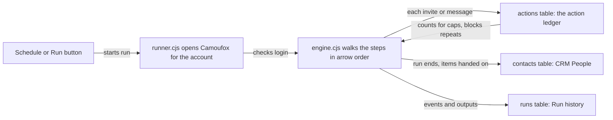

# Concepts

Read this once before building anything. Most surprises in this app ("why did it skip her?", "why did only 8 invites go?") come from one of the rules below.

## Workflow and step

A **workflow** is a set of steps joined by arrows, drawn on a canvas, much like n8n or Zapier. Each workflow belongs to one LinkedIn account, picked on the workflow page.

A **step** does one job: search people, open profiles, send an invite, ask the AI a question. Each step has settings, shown in the editor's right-hand panel when you click it. The full list is in [steps.md](steps.md).

A run hands a list of items from step to step. A step receives everything its incoming arrows carry, works through the list one item at a time, and hands its result on. A step that receives an empty list is skipped, and so is everything after it.

## Item kinds

Every item has a kind, and every step says which kinds it accepts and which it gives.

| Kind | What it is | Made by |
|---|---|---|
| trigger | an empty "go" signal | Start, Schedule |
| person | a LinkedIn profile (`/in/...` link), plus whatever steps learned about them | Search people, Post commenters, From CRM, LinkedIn URLs |
| post | a LinkedIn post, with its author and text | Search posts, Feed posts, LinkedIn URLs |
| page | a company or school page | LinkedIn URLs, Poll API |

The editor refuses arrows that carry the wrong kind. Joining Search posts straight to Send connection request shows "Step expects person items but gets post items", and the workflow cannot run until you fix it.

Items gather fields as they move. Search people gives `name`, `headline`, `location`, `degree` and `profileUrl`. Visit profile adds `about` and `experience`. AI qualify adds `evaluation.score` and `evaluation.reason`. Later steps can read any of these, in templates and in Condition rules.

## Handles and branches

The dots on the right edge of a step are its outputs, called handles. Most steps have one, `out`. Some split their items in two:

| Step | Handles |
|---|---|
| AI qualify, Keyword filter | `pass`, `fail` |
| Condition | `true`, `false` |
| Check replies | `replied`, `noReply` |
| Outreach sequence | `sent`, `needsYou`, `waiting`, `closed` |

Draw an arrow from the handle you want. A handle with no arrow simply drops its items, so leaving `fail` unconnected is the normal way to say "only continue with people who passed".

Workflows flow one way. A loop back to an earlier step is refused.

## Triggers and Active

A trigger is a step with no input, where a run starts.

- **Start** fires only when you press Run.
- **Schedule** fires every N minutes inside working hours on chosen days, shifted by a random number of minutes so runs do not land on the same minute each day.
- **Poll API** checks a JSON API every N minutes and starts a run with each record it has not seen before.

Schedule and Poll API fire on their own only while the workflow's **Active** switch is on and the app is open. Turning Active on is refused for a workflow with no Schedule or Poll API step, with no account, or with problems in the editor.

While any workflow is Active, closing the window on macOS hides the app instead of quitting, and the app stops macOS from putting it to sleep (App Nap), which would freeze its timers. Cmd+Q stops everything. A schedule never fires the moment you switch it on. It waits for its first slot.

Pressing Run on a workflow fires every trigger in it. When a schedule fires, only that schedule's branch runs.

## Runs and run history

A **run** is one pass through a workflow on one account. It does this, in order:

1. Opens the account's browser, using that account's saved profile.
2. Checks LinkedIn is still logged in. If not, the run fails with "log in again from the Accounts screen".
3. Runs the steps in arrow order.
4. Saves every step's output, files the people and posts it handed on into the CRM, and closes the browser.

Only one run uses an account's browser at a time. A schedule that comes due while its account is busy tries again 5 minutes later.

**Run history** in the sidebar lists every run of every workflow. Each run keeps a copy of the workflow as it was when it started, so editing the workflow later does not rewrite what history shows. A run ends as finished, failed, stopped (you pressed Stop), or interrupted (the app quit mid-run).

## The action ledger

Every time the app does something another person can see on LinkedIn, it writes a row to the `actions` table: the account, the target (a profile, post or page link), the action (`connect`, `message`, `followup`, `follow`, `like`, `comment`, `repost`), the result, and the run. You can read an account's rows under **Accounts, History**.

The ledger does two jobs: it is what caps count, and it is what stops the app doing the same thing twice. It is shared across every workflow on the account. Deleting a run's record from Run history does not delete its ledger rows.

## Caps

Each LinkedIn action step has a daily cap, and Send connection request also has a weekly one. Before acting, the step counts how many `sent` rows the ledger already has for this account and action in the last 24 hours (or 7 days), and stops when the allowance is used up. The rest wait for the next run.

Default caps per account:

| Action | Default |
|---|---|
| Invites | 20 per 24 hours, 100 per 7 days |
| Messages | 30 per 24 hours |
| Follow-ups | 20 per 24 hours |
| Follows | 30 per 24 hours |
| Reactions | 50 per 24 hours |
| Comments | 15 per 24 hours |
| Reposts | 5 per 24 hours |

These live in `electron/constants.cjs` (`LIMITS`). Each step can set its own cap, but the count it compares against is the whole account's. Say workflow A invites 15 people in the morning, and workflow B's invite step has a cap of 20. B sends 5 and stops, because the account has already sent 15 today.

Send connection request can also cap a single run ("Max invites per run", with a random ± spread), and Outreach sequence caps messages per run (15) and per day (40, intro and follow-ups together). Those spread the day's allowance over several scheduled runs instead of spending it all on the first.

The invite numbers come from the desktop app, which ships 30 a day; LinkedIn starts warning accounts near 100 a week. The engagement caps are cautious guesses, not measured limits.

If LinkedIn itself shows its weekly invitation limit, the invite step records `limit` and stops for that run.

## Never twice

A person invited or messaged, a page or person followed, or a post liked, commented on or reposted is skipped by every later run of every workflow on that account. The log says "done from this account before, skipped". Posts are matched by their activity id, so the same post found by two different searches counts once.

Things you did by hand count too. If the profile already shows Pending, the app records `pending` and moves on. If you already have a conversation with someone, Send message records `already_messaged` and never writes into it.

## Verification statuses

The app does not trust its own clicks. After each action it looks for LinkedIn's proof, and only `sent` counts.

| Status | Meaning | Flows on? | Blocks a repeat? |
|---|---|---|---|
| `sent` | LinkedIn confirmed it: the profile shows Pending, the message box cleared, the button reads pressed or Following, the comment appears under the post, the repost toast showed | yes | yes |
| `already` | it was already done before this run, for example a post you had liked | no | yes |
| `pending` | an invite to this person was already waiting | no | yes |
| `connected` | already a 1st-degree connection, so no invite | no | yes |
| `already_messaged` | a conversation already exists, so no first message | no | yes |
| `unverified` | the app clicked but never saw the proof; it may or may not have happened | no | no |
| `failed` | LinkedIn did not take it: no button, the message stayed in the box | no | no |
| `unavailable` | no Connect option on the profile | no | no |
| `not_connected` | tried to message someone who is not a 1st-degree connection | no | no |
| `limit` | LinkedIn's weekly invite limit showed | no | no |

`unverified` is the one to watch. A run full of them usually means LinkedIn changed its page and a selector in `constants.cjs` no longer matches. Open the browser yourself and check before running again.

## When a step gives up

One person failing (a deleted profile, a slow page) costs that person only, and the step moves on. Two things end the whole run:

- a lost login, at any point;
- the first three items of a step all failing. That pattern means the step is broken, for example a bad AI key or a stale selector, not that three people happened to be bad leads.

An AI answer the app cannot read is an error for that item, never a quiet "no".

## CRM stages

At the end of every run, each person and post handed between steps is filed in the CRM: one record per account and profile link. A later run updates the record, and a field the new run left blank keeps its old value, so last week's AI score survives a run that only re-searched.

Stages, in order: New, Invited, Connected, Messaged, Replied, Calendar sent, Qualified, Meeting booked, Won, Dropped, Lost.

The first five move on their own, forward only, from evidence:

- an invite `sent` or `pending` in the ledger makes someone Invited;
- a 1st-degree badge makes them Connected;
- a message or follow-up `sent` makes them Messaged;
- a reply seen by Check replies, a follow-up run or Outreach sequence makes them Replied.

The rest are never set by evidence, and the automatic rule never moves anyone out of them. You set them by hand in the person's panel, or a step sets them on purpose:

| Stage | Set by |
|---|---|
| Calendar sent | Outreach sequence, when the calendar message is `sent` |
| Meeting booked | Outreach sequence, when the AI reads a reply as "booked"; or Mark meeting booked in the panel |
| Dropped | Outreach sequence, after the last follow-up goes unanswered; or Drop in the panel |
| Lost | Outreach sequence, when the AI reads a reply as "not interested" |
| Qualified, Won | you, or an Update CRM step |

A stage set by hand can go anywhere and is written on the person's timeline.

## Outreach states

Outreach sequence keeps its own state on each CRM person, separate from the stage. The stage answers "how far along is this lead"; the outreach state answers "what is the sequence waiting for with this person". The People page shows it in the Outreach column and in the person's panel, where you can also stop or resume it.

| State | Meaning | Automation continues? |
|---|---|---|
| Invite sent | waiting for them to accept | yes |
| Connected, intro due | accepted; the intro goes on the next look | yes |
| Intro sent | waiting for a reply | yes |
| Follow-up 1 sent, Follow-up 2 sent | no reply yet, nudged | yes |
| Calendar link sent | they said yes; waiting to hear they booked | yes |
| Replied, needs you | a reply the AI could not place, or a send it could not confirm | no, until you press Resume |
| Handled by you | you wrote in the conversation yourself, or pressed Stop | no, until you press Resume |
| Meeting booked | they said they booked | no |
| Not interested | they said no | no |
| No reply, dropped | silent after the last follow-up | no |
| Invite never accepted | still not 1st degree after 21 days | no |

[topmate-workflows.md](topmate-workflows.md) walks through these with a diagram.
