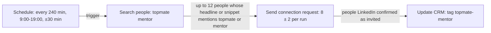
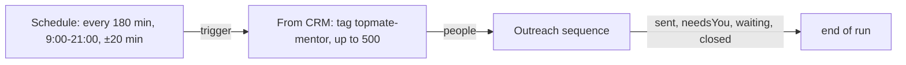
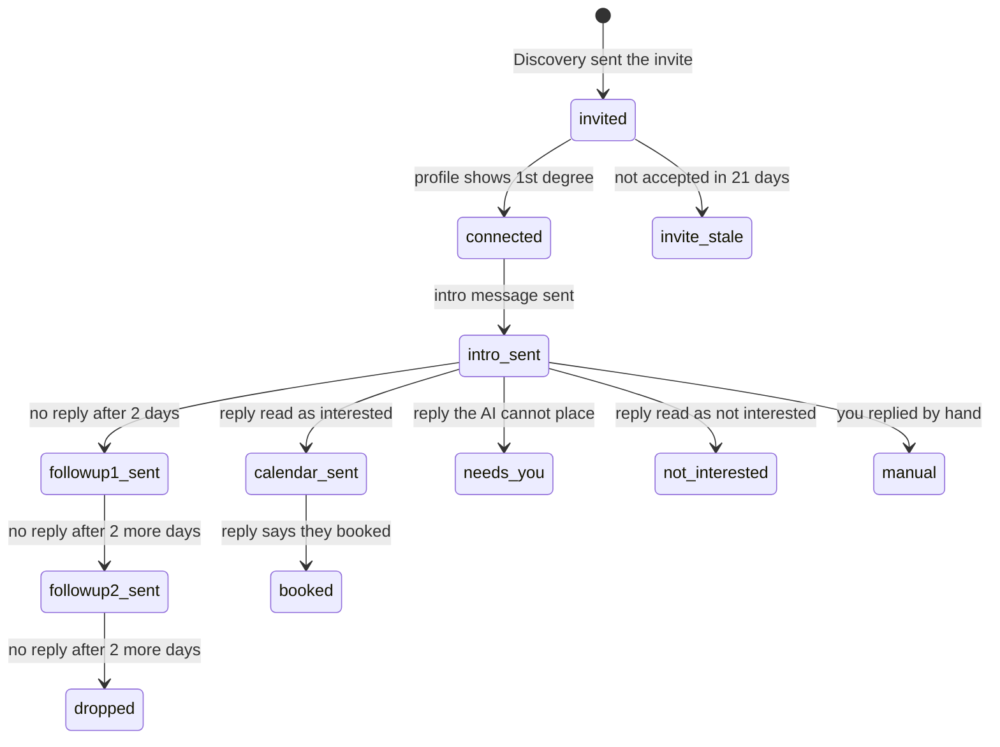

# The Topmate workflows

Two built-in workflows that work as a pair. **Topmate Mentor Discovery** finds mentors on LinkedIn and invites them. **Topmate Mentor Outreach** watches who accepted, introduces you, follows up, and sends your booking link to people who say yes. Both are added to every install once, on the first LinkedIn account if there is one. They start switched off. If you delete one, it stays deleted. You check the messages, set your calendar link, then switch them on.

The CRM tag `topmate-mentor` is what joins them. Discovery puts it on everyone it invites; Outreach reads everyone with it.

## Topmate Mentor Discovery

What each step does in a run:

1. **Schedule** fires about three times a day, every day of the week: every 240 minutes between 9:00 and 19:00, shifted up to 30 minutes either way.
2. **Search people** searches "topmate mentor" across all connection degrees. It keeps only people whose headline or search-result snippet mentions one of `topmate, topmate.io, mentor, mentoring, mentorship, career coach`, and skips anyone the CRM shows as already contacted (stage past New, or an invite already in the ledger). Both checks happen on the search results page, so nobody's profile is opened just to be rejected. It keeps up to 12 people and reads up to 10 result pages to find them.
3. **Send connection request** invites them, with a note that says you saw they mentor on Topmate and introduces HireDue. It adds the note only when the account can. Free LinkedIn accounts get a few personalised notes a month; once they run out, the app notices the Premium upsell and sends the rest without a note for the next 7 days, then tries a note again. Each run sends 8 ± 2 invites (so 6 to 10), at most 25 a day and 100 a week, and waits 45 to 120 seconds between invites.
4. **Update CRM** tags each invited person `topmate-mentor`. Only people LinkedIn confirmed as invited reach this step.

At three runs a day of about 8, the account sends roughly 24 invites a day, under the 25 daily cap, and reaches the 100 weekly cap in about four days. The weekly cap is what limits you in practice.

## Topmate Mentor Outreach

The schedule fires every 180 minutes between 9:00 and 21:00, every day, shifted up to 20 minutes. **From CRM** loads up to 500 people tagged `topmate-mentor` on this account, newest activity first. **Outreach sequence** decides, for each one, what is next. Most runs send nothing for most people, because most people are waiting for something: an accept, a reply, or the next follow-up date.

### What happens to one person

The reply arrows are drawn from `intro_sent` to keep the picture readable; they apply in the same way after either follow-up and after the calendar link.

In words, each time Outreach sequence looks at a person:

1. **Invite sent.** It opens their profile. If they are now 1st degree, they move to "Connected, intro due". If the invite is older than 21 days and still not accepted, it gives up: "Invite never accepted".
2. **Connected.** It opens the conversation. If it is empty, it sends your intro message. The built-in intro thanks them for connecting, mentions their Topmate mentoring, explains what HireDue does for job seekers, and asks if they are open to a quick chat. The intro carries no calendar link; asking someone to book a call in your first message is a fast way to be ignored.
3. **Intro or follow-up sent, no reply.** After the cadence, 2 days by default, it sends follow-up 1. Two days after that, follow-up 2. Two days after that, it drops them: "No reply, dropped", and the CRM stage becomes Dropped.
4. **They replied, and you have not.** An AI reads their reply and sorts it:
   - interested: it sends your calendar message, with `{{calendarLink}}` filled in from Settings, and keeps watching;
   - says they booked: "Meeting booked", and the CRM stage becomes Meeting booked;
   - not interested: "Not interested", and the stage becomes Lost. It stops;
   - anything else (a question about price, a partnership idea, something unclear): "Replied, needs you". The automation stops for this person and waits for you.

   If they write again after the calendar link went and the AI reads it as interested, that also goes to "needs you", so the link is never sent twice.
5. **You replied by hand.** If the last message in the conversation is one you typed yourself, not one the app sent, the automation stops: "Handled by you". It never talks over you.

Other rules:

- Each person is looked at no more than once every 6 hours, so a run every 3 hours does not reopen every conversation every time.
- At most 15 messages go per run and 40 per day, counting intro, follow-ups and calendar messages together across the account, with 20 to 60 seconds between them. A backlog of newly accepted invites goes out over several runs.
- Every send is checked the same way as Send message (the message box must clear) and recorded in the action ledger. A send the app could not confirm moves the person to "needs you" rather than risking a second copy. If the conversation cannot be read, the person is tried again on a later look; an unreadable conversation never counts as "no reply".
- Someone this account already messaged outside the sequence starts as "Handled by you". The sequence never takes over a conversation it did not start.

## Before you switch them on

1. **Settings, Calendar link.** Paste your booking page, for example `https://topmate.io/yourname`. With this blank, the calendar message fails for every interested person with "the text uses {{calendarLink}}, which this item has no value for", and nothing is sent to them.
2. **Account.** Both workflows start on the first account you added, or none if you had none at the time. Choose the same LinkedIn account on both. The CRM and the ledger are per account, so Outreach only sees people Discovery tagged on that account.
3. **Messages.** Open Topmate Mentor Outreach, press Edit steps, click Outreach sequence, and read every message. Change them to sound like you. `{{firstName}}` and any CRM field work.
4. **One watched run.** With Run the browser hidden off, press Run on Discovery once and watch. Check Run history: the search step's log says how many people it kept and skipped, and every invite in "Done on LinkedIn" should be `sent`.
5. **Active.** Switch both workflows Active. They fire only while the app is open.

## What to customise

| What | Where | Why you might |
|---|---|---|
| Search keywords | Discovery, Search people, Keywords | `topmate mentor` finds mentors broadly; `topmate product manager` narrows it |
| Must-mention words | Discovery, Search people, "Headline or search snippet must mention" | drop `mentor` to keep only people who name Topmate; words match whole, so `mentor` does not catch `mentorship` on its own |
| Invite note | Discovery, Send connection request, Note | keep it under 300 characters; it is skipped on accounts with no notes left |
| Invites per run, day, week | Discovery, Send connection request | lower them for a new or quiet account |
| Wait between invites | Discovery, Send connection request | 45 to 120 seconds is the built-in value; do not go below it on a schedule |
| People per search | Discovery, Search people, Max people to keep | 12 by default; it needs to be at least the per-run invite number, since some will be `pending` or skipped |
| Intro, follow-ups, calendar message | Outreach, Outreach sequence | these are the words people read |
| Days between messages | Outreach, Outreach sequence, cadence | 2 days is brisk; 3 to 4 reads as more patient |
| How replies are read | Outreach, Outreach sequence, "How the AI should read a reply" | the built-in prompt describes HireDue and what counts as interested, booked, not interested and other; rewrite it if your offer changes |
| Calendar link | Settings | one link for every workflow on this install |

## What to check in the CRM

Open **CRM, People**.

- Choose **Topmate Mentor Discovery** in the "Found by" filter to see everyone Discovery found first, including people it found but did not invite (already pending, or past the run's allowance). Filter by tag `topmate-mentor` to see only the people it invited, which is the list Outreach works on.
- The **Outreach** column shows each person's state, such as "Intro sent" or "Follow-up 1 sent".
- Press **Needs you** at the top to see only people who replied with something the AI could not place. These are the conversations to answer today. Open each on LinkedIn and reply yourself.
- Click a person to open their panel. The Outreach section shows the state, what happens next and when, every message sent with its time and result, their last reply and how the AI read it.
- The panel's buttons: **Stop automation** (it becomes "Handled by you"), **Resume automation** (for someone in "Needs you" or "Handled by you", after you have dealt with it), **Mark meeting booked**, and **Drop**.

Check the Needs you list once a day. A reply the AI could not place usually means a real person asked a real question, and they are waiting on you.
